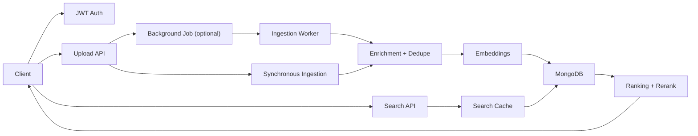

# TestCasesRAG

TestCasesRAG is a FastAPI backend for storing, enriching, searching, and maintaining software test cases and their linked Playwright scripts.

At a high level it solves four problems:

- teams keep test cases in spreadsheets and lose track of them
- keyword search misses semantically similar tests
- duplicate test cases get created because intent is hard to compare manually
- operational concerns like auth, audit, startup validation, caching, and health checks are usually bolted on too late

This upgraded build now includes JWT auth with RBAC, background ingestion jobs, cache invalidation, fail-fast startup validation, request metrics/tracing, health endpoints, admin-protected operational metrics, and pluggable LLM plus embedding backends.

## What The Application Does

- uploads CSV or Excel test cases
- stores test cases and scripts in MongoDB
- generates embeddings for semantic search
- uses a configurable LLM provider for enrichment, dedupe decisions, query expansion, and final reranking
- supports synchronous upload or queued background ingestion
- exposes admin and operational endpoints for stats, health, jobs, and metrics

## Request Flow



## Major Production Upgrades In This Version

- JWT bearer authentication with `viewer`, `editor`, and `admin` roles
- scope-based route protection
- audit logging on auth and mutating API calls
- startup configuration validation with fail-fast behavior
- request timing, tracing IDs, Prometheus-style metrics, and JSON metrics snapshots
- distributed cache support with Redis fallback to memory
- search cache invalidation on upload, update, and delete flows
- persistent background ingestion jobs stored in MongoDB
- job status endpoints for async upload workflows

## Core Components

- `app/main.py`: app bootstrap, lifespan, health, metrics, and route registration
- `app/routes/`: auth, upload, search, scripts, update, and admin endpoints
- `app/services/upload_pipeline.py`: shared ingestion pipeline for sync and async upload
- `app/services/ingestion_jobs.py`: persistent background queue and workers
- `app/core/security.py`: JWT creation, current-user resolution, scopes, and RBAC
- `app/core/cache.py` and `app/core/cache_layer.py`: cache access, namespace invalidation, Redis or memory backend
- `app/core/metrics.py`: operational metrics and Prometheus export
- `app/core/health.py`: readiness, liveness, deep diagnostics, and config checks
- `app/db/mongo.py`: Mongo client, indexes, mixed-ID helpers, and collection accessors
- `app/llm/client.py`: provider abstraction for Gemini, OpenAI, Anthropic, and local API-backed models
- `app/services/embeddings.py`: env-selected embedding model loader with runtime dimension detection

## LLM And Embedding Selection

Exactly one LLM provider should be enabled at a time:

- `LLM_USE_GEMINI=true`
- `LLM_USE_OPENAI=true`
- `LLM_USE_ANTHROPIC=true`
- `LLM_USE_LOCAL=true`

Supported providers:

- Google Gemini with `GOOGLE_API_KEY`
- OpenAI ChatGPT models with `OPENAI_API_KEY`
- Anthropic Claude models with `ANTHROPIC_API_KEY`
- Local or self-hosted APIs through `LOCAL_LLM_API_URL`

Local API formats:

- `openai` for OpenAI-compatible `/chat/completions`
- `anthropic` for Anthropic-compatible `/v1/messages`
- `generic` for simpler JSON text-generation responses

Exactly one embedding preset should be enabled at a time:

- `EMBEDDING_USE_MINILM_384=true`
- `EMBEDDING_USE_MPNET_768=true`
- `EMBEDDING_USE_BGE_LARGE_1024=true`

Preset mapping:

- `minilm_384` -> `sentence-transformers/all-MiniLM-L6-v2`
- `mpnet_768` -> `sentence-transformers/all-mpnet-base-v2`
- `bge_large_1024` -> `BAAI/bge-large-en-v1.5`

## Authentication Model

The API is no longer public.

- First successful `POST /auth/register` bootstraps the first user as `admin`
- Later registrations are admin-only unless `ALLOW_PUBLIC_USER_REGISTRATION=true`
- Clients authenticate via `POST /auth/login`
- Protected endpoints require `Authorization: Bearer <token>`

### Roles And Scopes

- `viewer`: search, testcase reads, script reads, stats reads
- `editor`: viewer scopes plus testcase writes and uploads
- `admin`: editor scopes plus destructive admin actions and user management

## Quick Start

### 1. Install

```bash
python -m venv .venv
. .venv/bin/activate
pip install -r requirements.txt
```

On PowerShell:

```powershell
python -m venv .venv
.venv\Scripts\Activate.ps1
pip install -r requirements.txt
```

### 2. Configure

Copy `.env.example` to `.env` and set at least:

```env
MONGO_CONNECTION_STRING=your-mongodb-connection-string
JWT_SECRET_KEY=replace-this-with-a-long-random-secret
CORS_ALLOWED_ORIGINS=http://localhost:3000,http://127.0.0.1:3000
LLM_USE_GEMINI=true
LLM_USE_OPENAI=false
LLM_USE_ANTHROPIC=false
LLM_USE_LOCAL=false
GOOGLE_API_KEY=your-gemini-key
EMBEDDING_USE_MINILM_384=true
EMBEDDING_USE_MPNET_768=false
EMBEDDING_USE_BGE_LARGE_1024=false
ALLOW_PUBLIC_USER_REGISTRATION=true
```

Only one `LLM_USE_*` flag and one `EMBEDDING_USE_*` flag should be `true`.

Examples:

- OpenAI: `LLM_USE_OPENAI=true` and `OPENAI_API_KEY=...`
- Anthropic: `LLM_USE_ANTHROPIC=true` and `ANTHROPIC_API_KEY=...`
- Local API: `LLM_USE_LOCAL=true`, `LOCAL_LLM_API_URL=...`, `LOCAL_LLM_API_FORMAT=openai`

### 3. Run

```bash
uvicorn app.main:app --host 0.0.0.0 --port 8001 --reload
```

### 3a. Run The Frontend In Development

The repository now includes a React + Vite frontend in `frontend/`.

```bash
cd frontend
npm install --ignore-scripts
node node_modules/esbuild/install.js
npm run dev
```

The Vite dev server runs on `http://localhost:5173` and proxies `/api`, `/auth`, `/health`, and `/metrics` to the backend.

### 3b. Build The Frontend For Backend Hosting

```bash
cd frontend
npm run build
```

After the build completes, FastAPI serves the frontend from `/app`.

### 4. Bootstrap The First Admin

```bash
curl -X POST http://localhost:8001/auth/register \
  -H "Content-Type: application/json" \
  -d '{
    "username": "admin",
    "password": "ChangeMe123!",
    "role": "admin"
  }'
```

### 5. Login

```bash
curl -X POST http://localhost:8001/auth/login \
  -H "Content-Type: application/x-www-form-urlencoded" \
  -d "username=admin&password=ChangeMe123!"
```

Use the returned `access_token` in all protected requests.

## Main API Surface

### Public

- `GET /`
- `GET /health`
- `GET /health/live`
- `GET /health/ready`
- `GET /health/deep`
- `POST /auth/register`
- `POST /auth/login`

### Authenticated

- `GET /auth/me`
- `POST /api/upload`
- `GET /api/upload/jobs`
- `GET /api/upload/jobs/{job_id}`
- `POST /api/search`
- `GET /api/scripts/{script_id}`
- `POST /api/scripts/batch`
- `PUT /api/update/{doc_id}`
- `GET /api/get-all`
- `GET /api/get-all-scripts`
- `GET /api/stats`
- `GET /api/get-by-id/{doc_id}`
- `GET /api/get-script/{script_id}`
- `DELETE /api/delete/{doc_id}` admin
- `POST /api/delete-all?confirm=true` admin
- `GET /metrics` admin
- `GET /metrics/json` admin

## Frontend Surface

The upgraded frontend is served by FastAPI from `/app` after a production build.

- `/app`: dashboard and overview
- `/app/search`: semantic search and result drill-down
- `/app/library`: testcase browser and curation workspace
- `/app/upload`: synchronous and background ingestion
- `/app/scripts`: linked Playwright script explorer
- `/app/operations`: health, stats, metrics, and admin controls

## Upload Modes

### Synchronous

```bash
curl -X POST "http://localhost:8001/api/upload" \
  -H "Authorization: Bearer $TOKEN" \
  -F "file=@Sample.xlsx"
```

### Background

```bash
curl -X POST "http://localhost:8001/api/upload?background=true" \
  -H "Authorization: Bearer $TOKEN" \
  -F "file=@Sample.xlsx"
```

Background mode returns `202 Accepted` with a job id and status endpoint.

## Search Example

```bash
curl -X POST http://localhost:8001/api/search \
  -H "Authorization: Bearer $TOKEN" \
  -H "Content-Type: application/json" \
  -d '{
    "query": "invalid login with wrong password",
    "feature": "Authentication",
    "ranking_variant": "A"
  }'
```

## Operational Endpoints

### Health

- `/health`: simple process check
- `/health/live`: liveness probe
- `/health/ready`: readiness probe with DB, cache, config, embedding, and ingestion checks
- `/health/deep`: deep diagnostics with counters and component state

### Metrics

- `/metrics`: Prometheus text output
- `/metrics/json`: structured snapshot for debugging or dashboards

Metrics include:

- per-route request counters
- average request duration by method and path
- cache hits and misses
- search and upload business counters
- background ingestion job counters
- sampled trace count

## Startup Validation

The app validates critical configuration before serving traffic.

Checks include:

- Mongo connection string present
- allowed CORS origins configured and not `*`
- JWT expiry and other numeric settings are valid
- Redis configuration is complete if `CACHE_BACKEND=redis`
- tracing sample rate is between `0` and `1`
- non-development environments must not use the default JWT secret
- exactly one LLM provider is enabled when LLM startup is required
- exactly one embedding preset is enabled

If `FAIL_FAST_STARTUP=true`, invalid startup configuration stops the app immediately.

## Cache Behavior

Search results are cached behind a namespace version.

That gives you two important properties:

- Redis can be shared across instances
- uploads, updates, and deletes invalidate search cache instantly without flushing the entire backend

Cache backends:

- `memory`
- `redis`
- `auto` which prefers Redis when configured and falls back to memory

## Background Ingestion

Background uploads are stored as MongoDB job records and processed by in-process workers.

Each job tracks:

- filename
- requesting user
- status
- timestamps
- result payload
- failure error if one occurred

Workers claim queued jobs atomically so scaled instances do not process the same job twice.

## Development Notes

- the upload pipeline is shared between sync and background execution
- writes to testcases and scripts use Mongo transactions
- mixed string UUID and legacy `ObjectId` records are still supported
- docs and examples in this repository now match the secured API, not the old public variant

## Documentation Map

- [QUICK_START.md](QUICK_START.md): shortest path to local setup
- [QUICK_REFERENCE.md](QUICK_REFERENCE.md): one-page endpoint and auth reference
- [API_EXAMPLES.md](API_EXAMPLES.md): concrete request examples
- [OPERATIONS_GUIDE.md](OPERATIONS_GUIDE.md): cache, health, metrics, startup validation, and background worker operations

## Verification Notes

The upgraded codebase was validated with:

- `python -m compileall app tests`
- focused pytest checks around auth-safe API behavior and operability features
- targeted runtime verification for background ingestion job processing

## Current Limitations

- background ingestion uses in-process workers, so queue processing depends on running app instances
- Redis is optional, not mandatory
- LLM-backed enrichment and reranking are best-effort unless explicitly required at startup

For most teams this is a strong production-ready baseline. If you want to go one step further after this, the next logical upgrade is externalizing the job queue to a dedicated worker system.


{
  "fields": [
    {
      "numDimensions": 384,
      "path": "main_vector",
      "similarity": "cosine",
      "type": "vector"
    },
    {
      "type": "filter",
      "path": "Feature"
    }
  ]
}